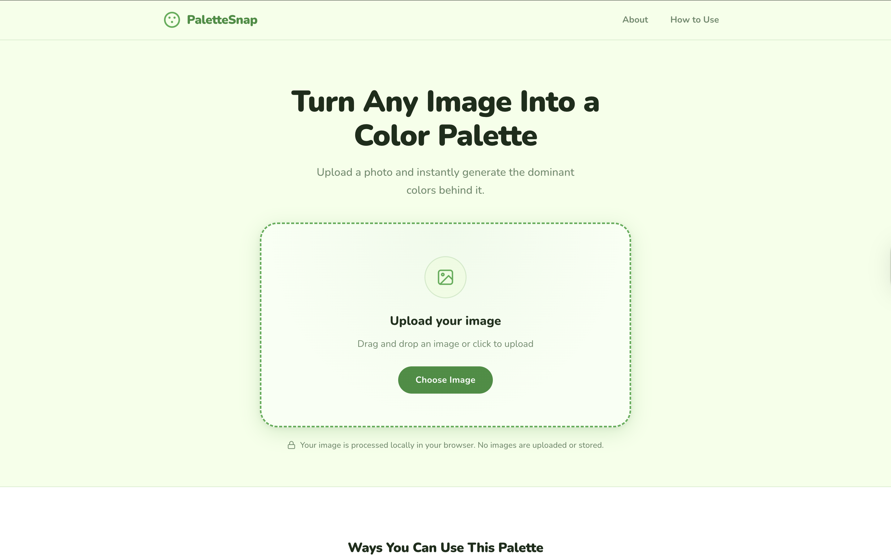
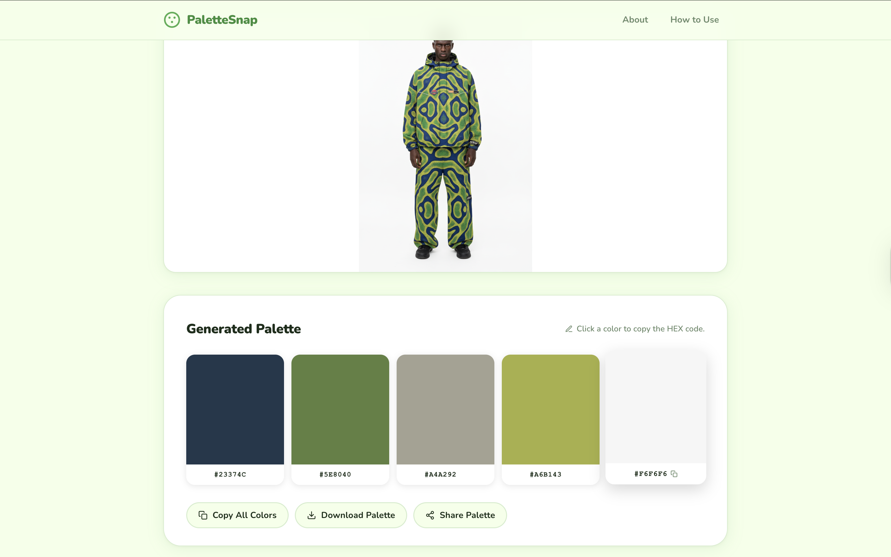
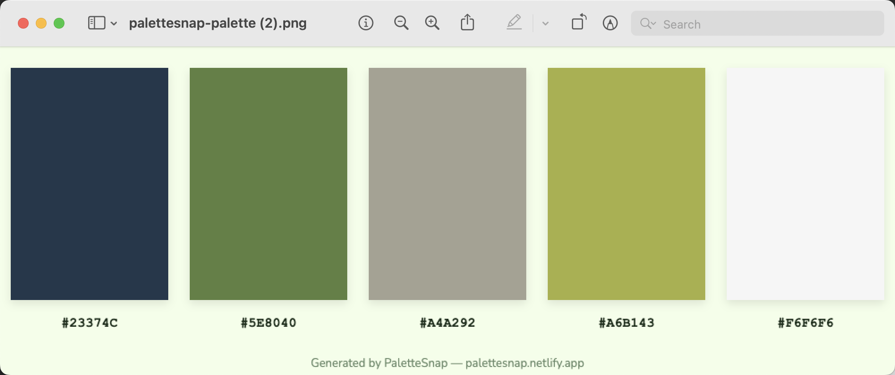

# PaletteSnap

> **Turn Any Image Into a Color Palette — Instantly.**

PaletteSnap is a free, open-source web tool that extracts the dominant colors from any image in seconds. No account needed. No uploads to a server. Everything runs privately in your browser.

Whether you are a designer, decorator, or just someone who loves color — PaletteSnap helps you capture the exact shades that inspire you.

---

## Live Demo

**Try it here:** [palette-snap.netlify.app](https://palette-snap.netlify.app)

> _(Replace with your live URL after deploying)_

---

## Screenshots

### Upload Screen

> _(Add a screenshot of the homepage and upload area here)_

### Generated Palette

> _(Add a screenshot showing an image with its extracted color palette)_

### Download Output

> _(Add a screenshot of the downloaded PNG palette file)_

---

## Features

- **Instant color extraction** — upload an image and get 5 dominant colors in seconds
- **Drag and drop** — drag an image file directly onto the page
- **Clipboard paste** — paste an image directly from your clipboard with Ctrl+V / Cmd+V
- **Click to copy** — click any color block to copy its HEX code instantly
- **Copy all colors** — copy all 5 HEX codes to your clipboard in one click
- **Download as PNG** — save your color palette as a clean, shareable image file
- **Share palette** — share your palette using your device's native share menu
- **100% private** — your image never leaves your device; no uploads, no storage
- **Mobile friendly** — works on phones, tablets, and desktops
- **No account required** — open the page and start immediately

---

## Who Is This For?

PaletteSnap is built for anyone who works with color:

| User | How They Use It |
|---|---|
| **Interior designers** | Extract color palettes from room photos and mood boards |
| **Fashion enthusiasts** | Match outfit colors from clothing and runway photos |
| **Brand designers** | Build cohesive color systems from inspirational images |
| **Hair and makeup artists** | Find exact shades from reference photos |
| **UI/UX designers** | Pull colors from screenshots and design references |
| **Artists and illustrators** | Capture palette inspiration from artwork and photography |
| **Social media creators** | Create consistent, on-brand color schemes for content |

---

## How to Use

_No technical knowledge needed. Just follow these steps:_

1. **Open the website** — visit the live demo link above in any browser
2. **Upload your image** — click the upload box, drag and drop a photo, or paste an image from your clipboard
3. **View your palette** — PaletteSnap instantly shows the 5 dominant colors from your image
4. **Copy a color** — click any color block to copy its HEX code to your clipboard
5. **Save or share** — click **Download Palette** to save a PNG, or **Share Palette** to send it

That is it. No sign-up. No waiting.

---

## Installation

_For developers who want to run PaletteSnap locally or contribute to the project._

### Requirements

- A modern web browser (Chrome, Firefox, Safari, Edge)
- [Git](https://git-scm.com/) installed on your machine
- No Node.js or package manager required — this is a zero-dependency project

### Steps

**1. Clone the repository**
```bash
git clone https://github.com/treasuretech005-sudo/palettesnap.git
```

**2. Navigate into the project folder**
```bash
cd palettesnap
```

**3. Open the project**

Option A — open directly in your browser:
```bash
open index.html
```

Option B — use VS Code with the Live Server extension:
- Right-click `index.html` and select **Open with Live Server**

Option C — use Python's built-in server:
```bash
python3 -m http.server 8080
```
Then visit `http://localhost:8080` in your browser.

> There is no build step, no `npm install`, and no configuration needed.

---

## Deploying Your Own Copy

### Deploy to Netlify (recommended)

1. Fork this repository to your GitHub account
2. Go to [netlify.com](https://netlify.com) and click **Add new site** then **Import an existing project**
3. Connect your GitHub account and select your forked repo
4. Set the **publish directory** to `.` (the root folder)
5. Click **Deploy site**

### Deploy to Vercel

1. Fork this repository to your GitHub account
2. Go to [vercel.com](https://vercel.com) and click **Add New Project**
3. Import your forked GitHub repo
4. Leave all settings as default — no build command needed
5. Click **Deploy**

> **Important note for Netlify users:** The included `netlify.toml` file is required. It prevents Cloudflare from obfuscating email links in the HTML, which would otherwise inject a script that breaks the upload functionality. Always deploy all files together — never replace only `index.html`.

---

## Tech Stack

| Technology | Role |
|---|---|
| HTML5 | Page structure and semantic markup |
| CSS3 | Styling, animations, and responsive layout |
| Vanilla JavaScript (ES6+) | All logic, color extraction, and interactivity |
| HTML Canvas API | Image pixel sampling and palette PNG generation |
| Google Fonts (Nunito) | Typography |
| K-Means Clustering | Dominant color extraction algorithm (custom implementation) |

**No frameworks. No libraries. No build tools. Zero dependencies.**

---

## Project Structure

```
palettesnap/
├── index.html        # Main HTML — page structure and SEO meta tags
├── style.css         # All styles — CSS variables, layout, animations
├── script.js         # All logic — color extraction, clipboard, download, share
├── netlify.toml      # Netlify configuration
└── README.md         # This file
```

---

## How Color Extraction Works

For the curious:

1. The uploaded image is drawn onto a hidden HTML `<canvas>` element
2. If the image is wider than 800px, it is resized first for performance
3. Pixel color data is sampled from the canvas using `getImageData()`
4. A **K-Means clustering** algorithm groups similar pixel colors into 5 clusters
5. The average color of each cluster becomes one dominant color
6. Colors are sorted by perceived brightness and displayed as HEX codes

---

## Contributing

Contributions are welcome and appreciated. Here is how to get involved:

### Reporting a Bug

1. Open the [Issues](https://github.com/treasuretech005-sudo/palettesnap/issues) tab
2. Click **New Issue**
3. Describe the bug, what you expected to happen, and your browser and device

### Suggesting a Feature

1. Open the [Issues](https://github.com/treasuretech005-sudo/palettesnap/issues) tab
2. Click **New Issue** and label it as a **Feature Request**
3. Describe the feature and why it would be useful

### Submitting Code

1. Fork the repository
2. Create a new branch: `git checkout -b feature/your-feature-name`
3. Make your changes
4. Commit with a clear message: `git commit -m "Add: your feature description"`
5. Push to your fork: `git push origin feature/your-feature-name`
6. Open a **Pull Request** against the `main` branch

### Contribution Guidelines

- Keep code clean and well-commented
- Do not introduce external libraries or frameworks — this project is intentionally dependency-free
- Test on both desktop and mobile before submitting a pull request
- One feature or fix per pull request

---

## Roadmap

Planned features for future releases:

- [ ] Choose between 3, 5, 8, or 10 extracted colors
- [ ] RGB and HSL color format display alongside HEX
- [ ] Color name labels (e.g. "Forest Green", "Dusty Rose")
- [ ] Export palette as CSS variables or JSON
- [ ] Light and dark mode toggle

Have an idea? [Open a feature request.](https://github.com/treasuretech005-sudo/palettesnap/issues)

---

## License

This project is licensed under the **MIT License** — free to use, modify, and distribute for personal and commercial projects.

```
MIT License

Copyright (c) 2026 Treasure Tech

Permission is hereby granted, free of charge, to any person obtaining a copy
of this software and associated documentation files (the "Software"), to deal
in the Software without restriction, including without limitation the rights
to use, copy, modify, merge, publish, distribute, sublicense, and/or sell
copies of the Software, and to permit persons to whom the Software is
furnished to do so, subject to the following conditions:

The above copyright notice and this permission notice shall be included in all
copies or substantial portions of the Software.

THE SOFTWARE IS PROVIDED "AS IS", WITHOUT WARRANTY OF ANY KIND, EXPRESS OR
IMPLIED, INCLUDING BUT NOT LIMITED TO THE WARRANTIES OF MERCHANTABILITY,
FITNESS FOR A PARTICULAR PURPOSE AND NONINFRINGEMENT. IN NO EVENT SHALL THE
AUTHORS OR COPYRIGHT HOLDERS BE LIABLE FOR ANY CLAIM, DAMAGES OR OTHER
LIABILITY, WHETHER IN AN ACTION OF CONTRACT, TORT OR OTHERWISE, ARISING FROM,
OUT OF OR IN CONNECTION WITH THE SOFTWARE OR THE USE OR OTHER DEALINGS IN THE
SOFTWARE.
```

---

## Contact

**Treasure Tech** — Building simple tools on the web.

- Email: [treasuretech005@gmail.com](mailto:treasuretech005@gmail.com)
- GitHub: [github.com/treasuretech005-sudo](https://github.com/treasuretech005-sudo)

> If you find PaletteSnap useful, consider giving the repo a star. It helps others discover the project.

---

_Made with care by Treasure Tech — 2026_
